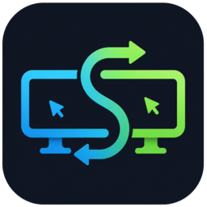
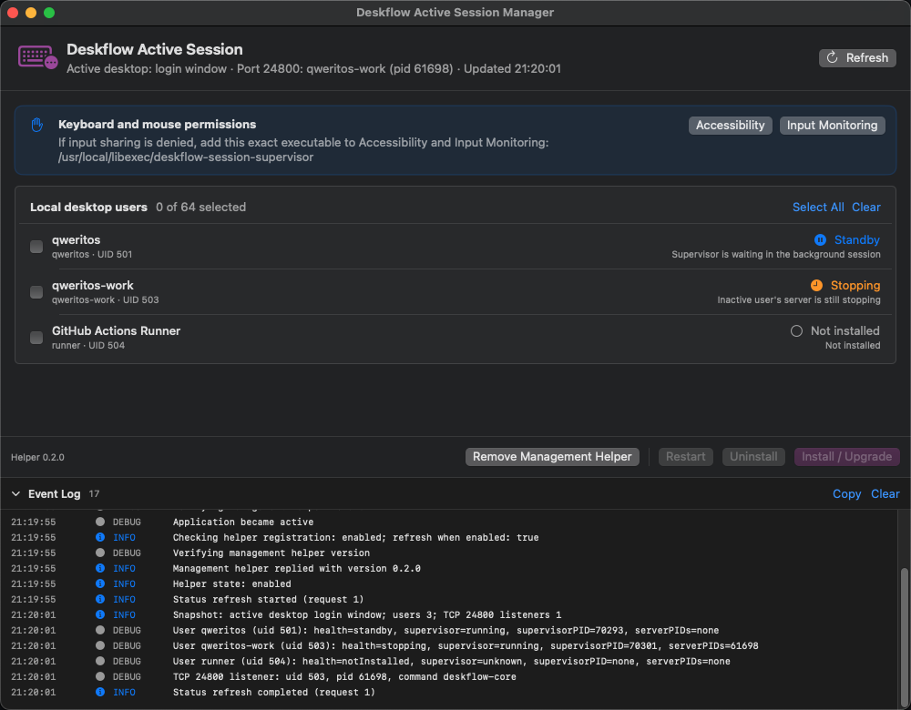

<div align="center">
  <h1> Deskflow Active Session</h1>
  <p>Share one Mac's keyboard and mouse regardless of which user session is active.</p>
</div>

<p align="center">
  <a href="https://github.com/qweritos/deskflow-active-session/releases"></a>
  <a href="https://github.com/qweritos/deskflow-active-session/blob/main/LICENSE"></a>
</p>

## Why

macOS keeps background desktop sessions running after Fast User Switching. If Deskflow starts for every user, multiple servers can compete for port 24800 and macOS input permissions.

This project runs a lightweight supervisor in each participating session. It starts the Deskflow CLI server for the foreground user and stops it when that session moves into the background. Each account keeps its own default Deskflow configuration, screen layout, certificates, and TLS keys.

## Requirements

- macOS 13 or newer
- Administrator access
- A local GUI account for every participating user
- Deskflow installed at `/Applications/Deskflow.app`

Install Deskflow with Homebrew if needed:

```bash
brew tap deskflow/tap
brew install deskflow
```

Sign into each participating account once, configure Deskflow in server mode, save its screen layout, then quit the Deskflow GUI and disable its login item.

## Install

### GUI manager



Download the DMG for your architecture from [Releases](https://github.com/qweritos/deskflow-active-session/releases), then drag **Deskflow ASM** to **Applications**.

I currently do not have a paid personal Apple Developer account available for Developer ID signing and notarization. The development-signed releases therefore trigger a Gatekeeper warning. After installing a release you trust, remove its quarantine and open it:

```bash
sudo /usr/bin/xattr -dr com.apple.quarantine "/Applications/Deskflow ASM.app"
open "/Applications/Deskflow ASM.app"
```

Use `/usr/bin/xattr` explicitly because an older `/usr/local/bin/xattr` may not support `-r`.

In the app:

1. Select **Set Up Helper**.
2. Approve it in **System Settings → General → Login Items** if prompted.
3. Select the participating accounts.
4. Select **Install / Upgrade**.

See the [GUI manager guide](docs/gui-manager.md) for upgrades, helper repair, and troubleshooting.

### CLI installer

Source installation requires Xcode Command Line Tools:

```bash
xcode-select --install
git clone https://github.com/qweritos/deskflow-active-session.git
cd deskflow-active-session
./scripts/install.sh alice alice-work
```

Run the same install command again to upgrade.

## macOS permissions

Grant **Accessibility** and **Input Monitoring** to the installed supervisor, not only to the Deskflow GUI:

```text
/usr/local/libexec/deskflow-session-supervisor
```

If an existing toggle does not work, remove the old entry, add the exact path again with `Command-Shift-G`, enable it, and restart the supervisor or log out and back in.

## Usage

```bash
# Check every managed account
./scripts/status.sh alice alice-work

# Restart the active account, or a named account
./scripts/restart.sh
./scripts/restart.sh alice

# Remove selected accounts, or all managed accounts
./scripts/uninstall.sh alice alice-work
./scripts/uninstall.sh --all
```

Logs are stored per user in `~/Library/Logs/Deskflow/`.

The GUI provides the same status, install, restart, and uninstall operations. Expand **Event Log** to inspect recent activity.

## Configuration

The supervisor runs:

```text
/Applications/Deskflow.app/Contents/MacOS/deskflow-core server
```

Deskflow automatically loads each user's default settings. This project does not copy or modify Deskflow configuration, certificates, or TLS keys.

The GUI supports the standard Deskflow path and port 24800. For custom paths or timing options, use the CLI and run:

```bash
deskflow-session-supervisor --help
```

## How it works

Each participating user gets an Aqua LaunchAgent running `deskflow-session-supervisor`. The supervisor watches session activation changes and ensures that only the foreground account owns the Deskflow server. The optional GUI helper manages these user-scoped installations but never runs Deskflow itself.

## Limitations

- Switching users briefly interrupts the remote client.
- The Deskflow GUI must remain closed while the supervisor is active.
- Every account needs a valid server layout and macOS input permissions.
- The login window and non-console sessions are not served.
- Development-signed releases display a Gatekeeper warning.

## Development

```bash
make check
make manager
open "Deskflow ASM.xcodeproj"
```

See [CONTRIBUTING.md](CONTRIBUTING.md), the [manual switching test](tests/manual-fast-user-switching.md), and the [manual GUI test](tests/manual-gui-manager.md).

## License

MIT. See [LICENSE](LICENSE).

This independent project is not affiliated with or endorsed by [Deskflow](https://github.com/deskflow/deskflow). Deskflow is not bundled or redistributed here.
